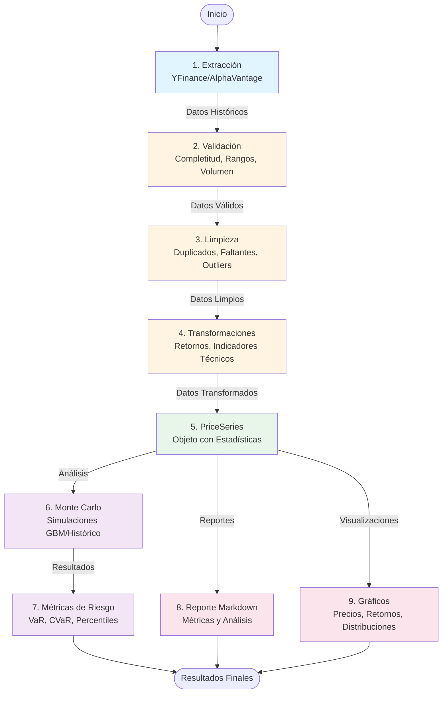
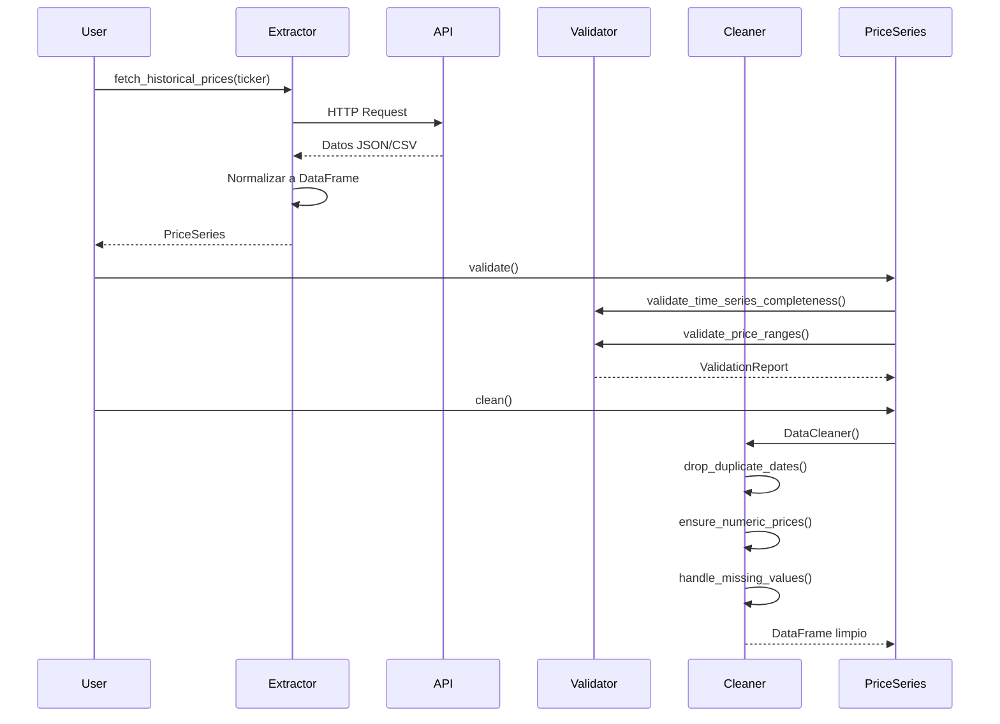
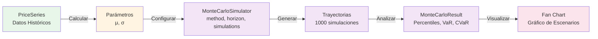
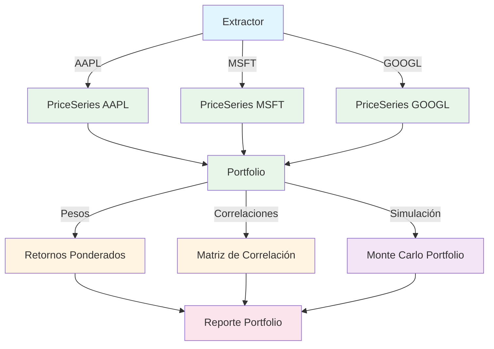
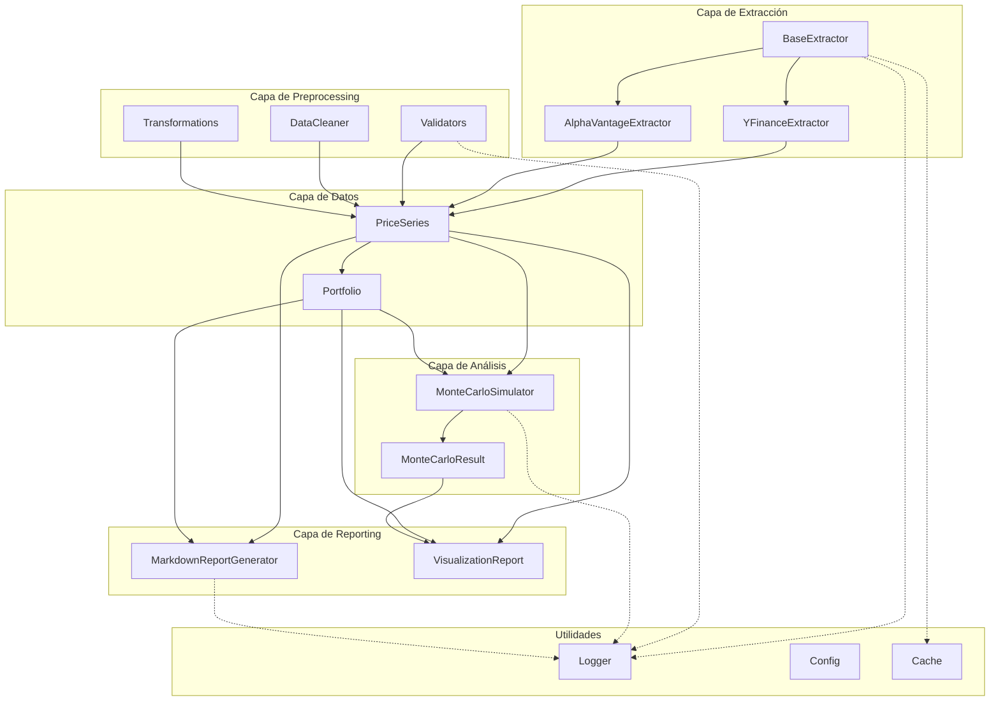
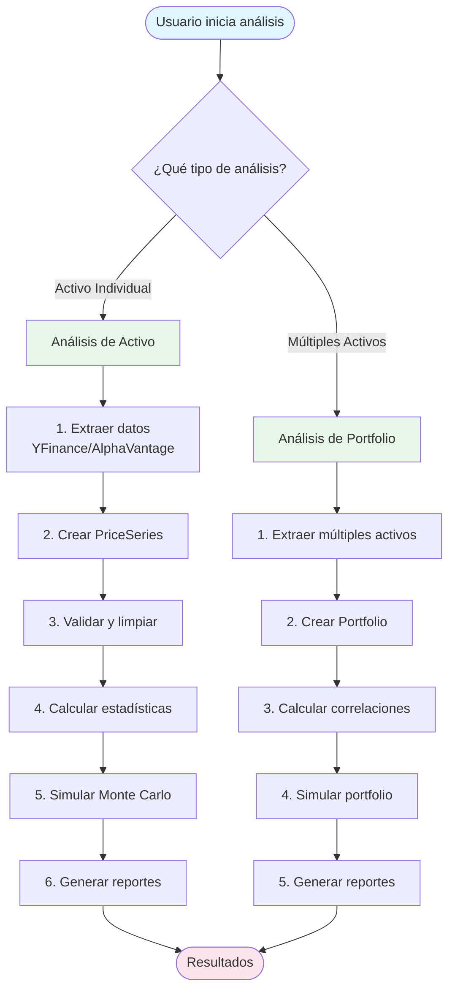

# Diagrama del Sistema

Diagrama visual del flujo completo del Sistema de Análisis Financiero.

## 📊 Flujo Principal del Sistema



## 🔄 Flujo Detallado por Componente

### Extracción → Preprocessing



### Análisis Monte Carlo



### Portfolio Multi-Activo



## 🏗️ Arquitectura de Componentes



## 📈 Flujo de Datos Completo



## 🔑 Conceptos Clave Visualizados

### PriceSeries - Estructura Interna

```
PriceSeries
├── ticker: str              # Símbolo del activo
├── data: DataFrame          # Datos históricos
│   ├── date                # Fechas
│   ├── close               # Precio de cierre
│   ├── adj close           # Precio ajustado
│   └── volume              # Volumen
├── name: str               # Nombre del activo
├── asset_type: str         # Tipo (equity, index, etc.)
└── Métodos:
    ├── clean()             # Limpieza
    ├── validate()          # Validación
    ├── get_returns()       # Retornos
    ├── volatility()        # Volatilidad
    ├── monte_carlo()       # Simulación
    ├── report()            # Reporte Markdown
    └── plots_report()      # Gráficos
```

### Portfolio - Estructura Interna

```
Portfolio
├── holdings: Dict[str, PriceSeries]  # Activos
├── weights: Dict[str, float]         # Pesos
├── name: str                         # Nombre
└── Métodos:
    ├── get_portfolio_returns()       # Retornos ponderados
    ├── portfolio_volatility()        # Volatilidad del portfolio
    ├── correlation_matrix()          # Correlaciones
    ├── portfolio_value_history()     # Evolución del valor
    ├── monte_carlo()                 # Simulación
    ├── report()                      # Reporte
    └── plots_report()                # Gráficos
```

## 📝 Resumen del Flujo

1. **Extracción**: APIs externas → Datos normalizados
2. **Validación**: Verificar calidad y completitud
3. **Limpieza**: Eliminar errores y normalizar
4. **Transformación**: Calcular métricas financieras
5. **Data Classes**: Encapsular en objetos estructurados
6. **Análisis**: Simulaciones Monte Carlo
7. **Reporting**: Generar reportes y visualizaciones

Cada paso es independiente y puede ejecutarse por separado, pero juntos forman un pipeline completo de análisis financiero.

